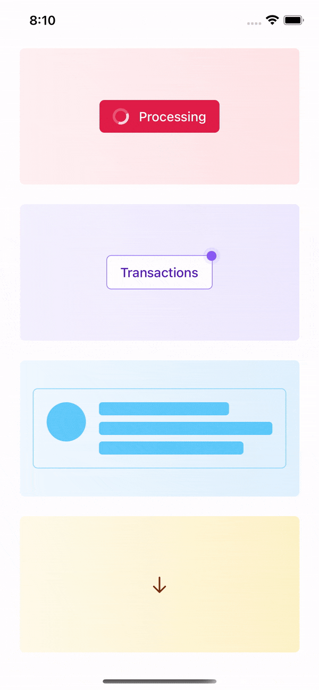

# react-native-animation-utils

⚡️ Animation utilities for React Native

Inspired by Tailwind CSS

<p align="center">

</p>

## Installation

```sh
npm install react-native-animation-utils
```

or

```sh
yarn add react-native-animation-utils
```

## Usage

More detailed documentation coming. See [example/](https://github.com/ecklf/react-native-animation-utils/tree/main/example) for now.

<!-- ```js
import { Bounce, Ping, Pulse, Spin } from "react-native-animation-utils";

``` -->

<!-- ## Contributing

See the [contributing guide](CONTRIBUTING.md) to learn how to contribute to the repository and the development workflow. -->

## License

MIT
